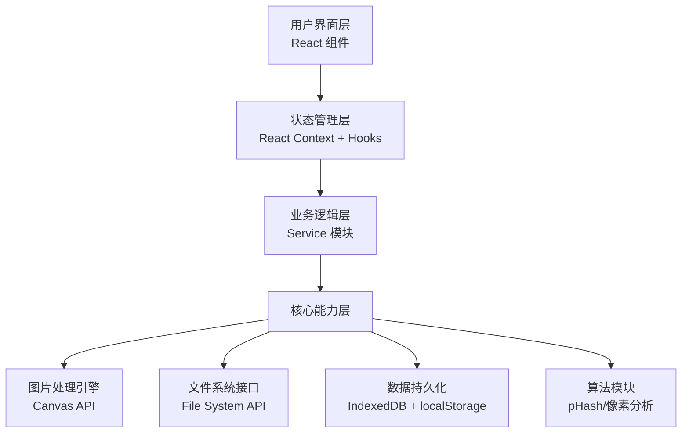
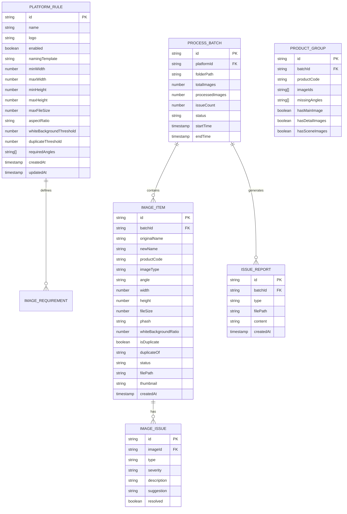

## 1. 架构设计



## 2. 技术描述

- **前端框架**：React@18 + TypeScript + Vite@5
- **样式方案**：TailwindCSS@3 + PostCSS
- **状态管理**：React Context + useReducer + 自定义Hooks
- **图标库**：Lucide React（线性图标，风格统一）
- **图片处理**：HTML5 Canvas API（客户端处理，无需上传服务器）
- **文件访问**：File System Access API（支持文件夹选择和监控）
- **数据存储**：
  - IndexedDB：存储操作记录、处理历史（大量数据）
  - localStorage：存储配置、平台规则（小量数据）
- **核心算法**：
  - pHash（感知哈希）：重复图片检测
  - 像素采样分析：白底检测、尺寸校验
  - 文件名模式匹配：商品编码提取、类型识别
- **导出功能**：JSZip（打包下载）、xlsx（Excel导出）

**设计原则**：纯前端应用，所有处理在浏览器端完成，保护用户数据隐私，无需后端服务器。

## 3. 目录结构

```
src/
├── assets/              # 静态资源
│   └── styles/          # 全局样式、变量、动画
├── components/          # 可复用组件
│   ├── common/          # 通用组件（Button、Card、Modal等）
│   ├── dashboard/       # 仪表盘组件
│   ├── processor/       # 图片处理组件
│   ├── rules/           # 规则配置组件
│   └── history/         # 历史记录组件
├── contexts/            # React Context
│   ├── AppContext.tsx   # 全局应用状态
│   └── ProcessContext.tsx # 处理流程状态
├── hooks/               # 自定义Hooks
│   ├── useFileWatcher.ts # 文件监控Hook
│   ├── useImageProcessor.ts # 图片处理Hook
│   └── useLocalStorage.ts # 本地存储Hook
├── services/            # 业务逻辑层
│   ├── imageService.ts  # 图片处理服务
│   ├── fileService.ts   # 文件操作服务
│   ├── ruleService.ts   # 规则管理服务
│   └── exportService.ts # 导出服务
├── utils/               # 工具函数
│   ├── phash.ts         # 感知哈希算法
│   ├── pixelAnalyzer.ts # 像素分析工具
│   ├── filenameParser.ts # 文件名解析
│   └── formatters.ts    # 格式化工具
├── types/               # TypeScript类型定义
│   ├── index.ts         # 核心类型
│   └── constants.ts     # 常量定义
├── pages/               # 页面组件
│   ├── Dashboard.tsx    # 仪表盘
│   ├── ImageProcessor.tsx # 图片处理
│   ├── RuleConfig.tsx   # 规则配置
│   └── History.tsx      # 历史记录
├── data/                # Mock数据和初始配置
│   └── defaultRules.ts  # 默认平台规则
├── App.tsx              # 根组件
├── main.tsx             # 入口文件
└── router.tsx           # 路由配置
```

## 4. 路由定义

| 路由 | 页面 | 用途 |
|------|------|------|
| / | 仪表盘 | 处理概览、快捷操作、最近记录 |
| /processor | 图片处理 | 文件夹监控、图片检测、批量处理、导出 |
| /rules | 规则配置 | 平台规则管理、命名模板配置 |
| /history | 历史记录 | 操作日志、处理详情、报告下载 |

## 5. 核心数据模型

### 5.1 数据模型定义



### 5.2 核心TypeScript类型定义

```typescript
// 平台规则
interface PlatformRule {
  id: string;
  name: string;
  logo: string;
  enabled: boolean;
  namingTemplate: string;
  imageRequirements: ImageRequirement[];
  settings: PlatformSettings;
  createdAt: number;
  updatedAt: number;
}

interface ImageRequirement {
  type: 'main' | 'detail' | 'scene';
  minWidth: number;
  maxWidth: number;
  minHeight: number;
  maxHeight: number;
  maxFileSize: number;
  aspectRatio: string;
  requireWhiteBackground: boolean;
}

interface PlatformSettings {
  whiteBackgroundThreshold: number;
  duplicateThreshold: number;
  requiredAngles: string[];
}

// 图片项
interface ImageItem {
  id: string;
  batchId: string;
  originalName: string;
  newName: string;
  productCode: string;
  imageType: 'main' | 'detail' | 'scene' | 'unknown';
  angle: string;
  width: number;
  height: number;
  fileSize: number;
  phash: string;
  whiteBackgroundRatio: number;
  isDuplicate: boolean;
  duplicateOf: string | null;
  status: 'pending' | 'processing' | 'completed' | 'error';
  issues: ImageIssue[];
  file: File;
  preview: string;
  createdAt: number;
}

interface ImageIssue {
  id: string;
  type: 'dimension' | 'fileSize' | 'whiteBackground' | 'duplicate' | 'missingAngle' | 'naming';
  severity: 'error' | 'warning' | 'info';
  description: string;
  suggestion: string;
  resolved: boolean;
}

// 处理批次
interface ProcessBatch {
  id: string;
  platformId: string;
  folderPath: string;
  totalImages: number;
  processedImages: number;
  issueCount: number;
  status: 'idle' | 'scanning' | 'processing' | 'completed' | 'error';
  images: ImageItem[];
  productGroups: ProductGroup[];
  startTime: number;
  endTime: number | null;
}

interface ProductGroup {
  id: string;
  productCode: string;
  imageIds: string[];
  missingAngles: string[];
  hasMainImage: boolean;
  hasDetailImages: boolean;
  hasSceneImages: boolean;
}

// 导出配置
interface ExportConfig {
  generateUploadFolder: boolean;
  generateCompressed: boolean;
  generateIssueReport: boolean;
  generateReviewList: boolean;
  compressionQuality: number;
}
```

## 6. 核心算法说明

### 6.1 感知哈希 (pHash) 算法

用于重复图片检测，流程如下：
1. 将图片缩小至 32x32 像素
2. 转换为灰度图
3. 计算 DCT（离散余弦变换）
4. 取左上角 8x8 的 DCT 系数
5. 计算这些系数的平均值
6. 将每个系数与平均值比较，生成 64 位哈希值
7. 比较两张图片的哈希值，计算汉明距离
8. 汉明距离 < 5 判定为相似图片

### 6.2 白底检测算法

1. 采样图片四角和边缘的像素点（共约100个采样点）
2. 对每个采样点判断是否为白色：
   - R > 240, G > 240, B > 240
   - 或转换为 HSV，饱和度 < 10%，明度 > 95%
3. 计算白色像素占采样点总数的比例
4. 比例 > 阈值（默认95%）判定为白底

### 6.3 商品编码提取规则

1. 优先匹配文件名中的 SKU 模式：
   - 字母+数字组合，长度 6-20 位
   - 常见分隔符：-_ 空格
2. 匹配规则优先级：
   - 文件名开头的编码
   - 被分隔符包围的编码
   - 符合电商平台常见编码格式
3. 可配置自定义正则表达式

### 6.4 图片类型识别

按以下优先级判断：
1. 文件名关键词匹配：
   - 主图：主图、main、首图、封面、01
   - 细节图：细节、detail、特写、展示
   - 场景图：场景、scene、模特、实拍
2. 基于内容的判断：
   - 主图：白底比例最高 + 正方形
   - 场景图：非白底图片
   - 细节图：介于两者之间

### 6.5 图片压缩算法

使用 Canvas API 进行渐进式压缩：
1. 从 quality = 0.9 开始
2. 每次降低 0.1，重新压缩
3. 直到文件大小符合要求或 quality = 0.5
4. 如果仍不符合，按比例缩小尺寸
5. 确保输出尺寸不小于平台最小要求
